# What Looks Like Illiquidity

**Instrument composition and range-based volatility estimation in a frontier market.**

> **Status: post-audit rebuild, 2026-08-29.** Exploratory unless a claim is explicitly labelled
> otherwise. One hypothesis has been evaluated on held-out data; its confirmatory provenance
> carries a stated qualification. `./run_pipeline.sh` reproduces every exhibit from raw data.

## The finding

NEPSE publishes ordinary equity, corporate debentures, closed-end mutual funds and restricted
promoter shares in one daily file **with no instrument-type field**. Sort that pooled universe on
trading intensity and you reproduce the textbook picture of range estimators breaking down in thin
securities. Restrict it to the 291 ordinary equities and the picture inverts.

| | pooled universe | ordinary equity |
|---|---|---|
| stock-days | 184,390 | 143,149 |
| median trades/day | 111 | **165** |
| 10th percentile trades/day | 4 | **37** |
| `P(H = L)` | 5.70% | **0.28%** |
| Parkinson exactly zero | 5.70% | **0.28%** |
| Rogers–Satchell exactly zero | 15.25% | **4.35%** |

The thinnest decile of the pooled universe is **94.3% non-equity**. Debentures and restricted
promoter shares are illiquid because of what they are, not because Nepal is a frontier market. On
ordinary equity, Rogers–Satchell against a matched open-to-close benchmark is **0.998 on a variance
scale** — there is essentially no estimator bias left to diagnose.

Restricting samples to ordinary common shares is long-standing practice in the emerging-market
liquidity literature (Lesmond 2005; Bekaert, Harvey and Lundblad 2007), so the remedy is not new.
What this repository documents is the range-estimator form of the problem — a range estimator on a
bar with `H = L` returns *exactly zero* rather than becoming noisy — in a market where the filter
cannot be applied mechanically because the exchange publishes no type field.

## Architecture

Every scientific rule has one definition and one place it is applied. Order matters and is fixed:
duplicate detection runs on **original** values, before repair, because repairing first can push two
conflicting bars to identical extrema and silently reclassify a conflict as an exact duplicate.

```mermaid
flowchart TD
    RAW["Immutable raw vault<br/><i>1,268 CSVs, checksummed</i>"]

    subgraph CLEAN["Pre-committed cleaning &mdash; scripts/02"]
        direction TB
        CLS["Instrument classification<br/><i>ticker convention, validated against par value</i>"]
        DUP["Duplicate resolution<br/><i>on ORIGINAL values</i><br/>exact collapsed &middot; conflicting excluded"]
        REP["OHLC envelope repair<br/><i>PAP §3.1</i><br/>H := max&#40;H,O,C&#41; &middot; L := min&#40;L,O,C&#41;"]
        CLS --> DUP --> REP
    end

    GATE{{"Invariant gate<br/><b>halts the build</b>"}}
    EQ["equity_sample<br/><i>143,149 &times; 291</i>"]
    FULL["analysis_sample<br/><i>184,390 &times; 520</i>"]

    subgraph EST["Estimators &amp; inference &mdash; src/nepsevol"]
        direction TB
        RANGE["range_.py<br/><i>PK &middot; GK &middot; RS &middot; YZ &middot; AddRS</i>"]
        RATIO["ratios.py<br/><i>scale-explicit: variance vs SD</i>"]
        WCB["stats/wcb.py<br/><i>wild cluster bootstrap</i>"]
    end

    OUT["Tables, figures, manuscript<br/><i>+ BUILD-MANIFEST.json</i>"]

    RAW --> CLEAN --> GATE
    GATE -->|"passes"| EQ
    GATE -->|"passes"| FULL
    GATE -.->|"fails"| STOP["build stops"]
    EQ -->|"main result<br/>D-0012 option C"| EST
    FULL -->|"composition warning"| EST
    EST --> OUT
```



**Why the gate halts rather than warns.** Several defects reached committed results in this project
because nothing refused to continue. `validate.py` raises on a broken OHLC envelope, `high < low`,
negative Garman–Klass or Rogers–Satchell on a valid bar, duplicated security-days, a non-equity row
inside the equity sample, or unparsed dates. It tests structure, never expected answers — no row
count and no coefficient sign is frozen into a test.

**Provenance.** Every build writes `BUILD-MANIFEST.json` recording the git commit and dirty state,
the raw-data hash, the cleaning-code hash, rule versions, and the shape of each artifact — plus a
field-level repair audit naming every changed value and why. An earlier confirmatory result in this
project was computed on a panel build that was silently replaced hours later; recovering it required
checking out an old commit and rebuilding from the vault.

## Paper

| file | contents |
|---|---|
| `paper/main.md` | the manuscript, 11 sections |
| `paper/literature-review.md` | companion review, every source carrying a verification level |

Verification levels used throughout: **RECORD VERIFIED** (bibliographic record confirmed),
**CLAIM VERIFIED** (the attributed sentence checked against the source's own abstract),
**EQUATION UNVERIFIED**, **UNVERIFIED**. Nothing reaches CLAIM level on a secondary summary of a
paywalled paper. Every bibliographic record is currently verified; four primary texts remain unread
and are named in the review.

### Relationship to the earlier iteration

This repository was restructured on 2026-08-27. The previous flat-layout project remains reachable
in git history at `7ebb37a` and is not deleted. One of its findings closes off a line of enquiry and
should be cited rather than re-discovered: **India VIX is not a viable implied-volatility proxy for
NEPSE** (R² ≈ 1.1% at one day, insignificant at longer horizons).

Its headline claim — that range estimators fail in NEPSE's thinnest securities — **does not survive
an instrument filter** and is superseded by the finding above.

Data files from that iteration are held outside version control while their redistribution rights
are resolved.

## Repository layout

```
config/        run configuration — paths, parameters, seeds
data/
  raw/         immutable inputs (see data/raw/README.md for current status)
  interim/     intermediate, fully regenerable
  processed/   analysis-ready, fully regenerable
  external/    macro series, holiday calendars
src/nepsevol/
  ingest/      data acquisition and parsing
  trading_calendar/  session detection — Sun–Thu until Apr 2026, Mon–Fri after
  clean/
    ohlc.py            envelope repair + duplicate classification (one definition, fixed order)
    limits.py          price-limit and pre-open band rules
    special_sessions.py  documented exceptions to the weekday rule, with verification status
  universe/    instrument classification, validated against par value
  estimators/
    range_.py          PK · GK · RS · YZ · GKYZ · AddRS
    ratios.py          scale-explicit ratios — no ambiguous ratio()
  stats/wcb.py   wild cluster bootstrap; exact enumeration at small G
  evaluation/  loss functions, spread estimators, microstructure diagnostics
  models/      latent-state volatility model, HAR, proxy-robust forecast evaluation
  sample.py    universe selection — equity vs full, stated in the run log
  validate.py  invariant gate; raises rather than warns
  provenance.py  build manifest
scripts/       numbered pipeline; runs top to bottom from a clean state
               (21 is SUPERSEDED and exits on import)
tests/         89 tests; each targets a defect the audit actually found
notebooks/     01_exploratory_analysis.ipynb, 02_models.ipynb
output/        figures, tables, logs (all regenerable)
paper/         main.md + literature-review.md
output/superseded-*/  archived pre-rebuild artifacts, retained not overwritten
docs/          data dictionary, methodology, reproduction instructions
```

## Reproduction

```bash
python3 -m venv .venv && source .venv/bin/activate
pip install -r requirements.txt
pip install -e .

for s in scripts/[0-9]*.py; do python "$s"; done
```

Or simply:

```bash
./run_pipeline.sh
```

See `docs/reproduction.md`. If the pipeline does not reproduce every exhibit from a clean state,
that is a defect in the pipeline, not an acceptable state.

### Exploratory notebook

`notebooks/01_exploratory_analysis.ipynb` is the diagnostic companion to the paper: data
integrity, distributional tests, autocorrelation and stationarity, structural breaks, the
Sunday–Thursday calendar, liquidity measures, estimator comparison, GARCH-family fits, and
the bias-versus-trading-intensity result. It is stored **executed**, so every figure and
table can be read without running anything.

```bash
./.venv/bin/jupyter lab notebooks/01_exploratory_analysis.ipynb
```

### Model notebook

`notebooks/02_models.ipynb` builds and evaluates the models. Its premise is that NEPSE has no
observable ground truth, so two devices carry the work:

- **Future squared returns as a noisy but unbiased proxy**, scored with proxy-robust losses
  (MSE, QLIKE per Patton 2011), a Diebold–Mariano test, and a Model Confidence Set — which
  reports a *set* of indistinguishable models rather than a spurious single winner.
- **A latent-state model** in which log-variance is an unobserved AR(1) and each estimator is
  a biased, noisy measurement of it, so the measurement intercepts identify estimator bias
  from data alone.

Both are validated against known answers before being applied: the evaluation machinery must
recover a known forecast ranking, and the state-space model must recover a known simulated
bias, before either is trusted on real data.

Models compared: HAR (Corsi) on each of five variance measures · EWMA/RiskMetrics ·
GARCH(1,1)-t · GJR-GARCH-t · random walk · constant.

The notebooks explore; they do not define the pipeline. Anything load-bearing lives in
`src/nepsevol/` and `scripts/`.

## Data

The primary input is the NEPSE daily index series (OHLC + turnover), 2010-01-03 → 2026-06-12.

Three properties of this data drive much of the design and are documented in `docs/data_dictionary.md`:

1. **Genuine intraday extremes begin only 2016-06-06.** Earlier rows carry `Open == High == Low == Close`,
   which makes every range-based estimator undefined. The usable sample is 2,296 trading days.
2. **The trading week is Sunday–Thursday.** Annualization and overnight-return conventions both
   differ from the Monday–Friday standard the estimators were written for.
3. **69 rows violate OHLC consistency** within the usable window and require a pre-committed
   handling rule.

Raw-data redistribution rights are unresolved; `data/raw/README.md` records the current state.

## Requirements

Python 3.14 (verified working). See `requirements.txt`.

## Licence

Code: MIT (see `LICENSE`). Data: subject to source terms — see `data/raw/README.md`.
